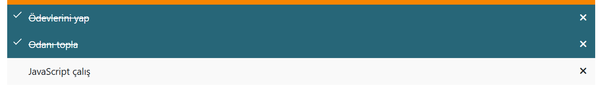
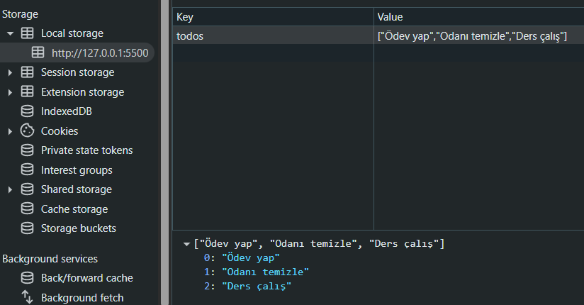
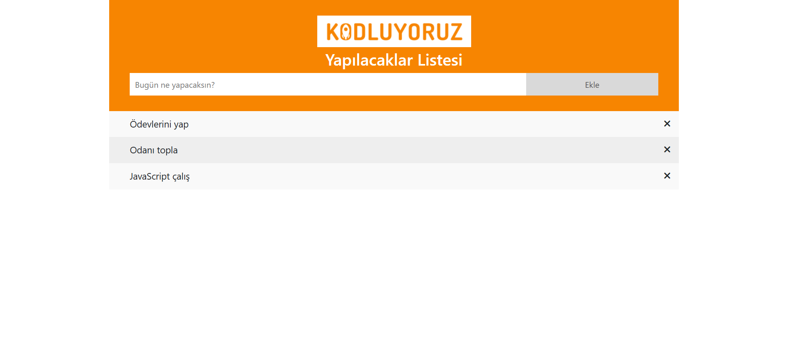

# :ballot_box_with_check: To-Do List Project

[🇹🇷 Click for Turkish README](./README.tr.md)

*Created on: March 14, 2025*

* This project was created as **Week-6 / Assignment-1 / To-Do List** for the Patika Frontend Bootcamp.
* Developed as a practice project for **JavaScript** and dynamic web applications.
* Built with **HTML**, **CSS**, **Bootstrap 4**, and **JavaScript**.
* Features and logic are inspired by [this example project](https://javascript-to-do-app.netlify.app/).

---

## 🌐 Live Demo

Visit the live website: [To-Do List Project](https://todo-list-js-wheat.vercel.app/)

---

## :computer: Installation and Usage

1. Clone the project:
```bash
git clone https://github.com/tunahanyasar/todo-list-js.git
```
2. Navigate to the project directory:
```bash
cd todo-list-js
```
3. Open `index.html` in a web browser.

---

## 📜 Project Structure

:open_file_folder: **Folders;**
* `index.html` - Main page
* `style.css` - Custom stylesheet
* `main.js` - JavaScript logic
* `img-page/` - Screenshots for the README

### Main Features
- **Add Task:** Add new tasks to the list
- **Toast Notifications:** Success and error toasts for adding/removing tasks
- **Delete Task:** Remove tasks by clicking the cross icon
- **Check Task:** Mark tasks as completed by clicking on them
- **Local Storage:** All tasks are saved and loaded from local storage

---

## :star2: Key Features

- Add, delete, and check tasks interactively
- Toast notifications for user feedback
- Persistent data with localStorage
- Responsive and modern UI with Bootstrap 4

---

## 💡 Technologies Used

**Frontend:**
* HTML5
* CSS3
* Bootstrap 4
* JavaScript (localStorage, Functions, DOM, Toast)

---

## 🎯 Project Goals

1. **User Experience**
   - Simple, interactive, and visually appealing to-do list
   - Real-time feedback with toast notifications
2. **Technical Achievements**
   - Practice with JavaScript DOM, events, and localStorage
   - Custom styling with CSS and Bootstrap

---

## 📸 Screenshots

### Checked Task


### Local Storage


### Full Page


---

## 📞 Contact

[Tunahan Yaşar](https://github.com/tunahanyasar)

* GitHub: [@tunahanyasar](https://github.com/tunahanyasar)
* LinkedIn: [Tunahan Yaşar](https://www.linkedin.com/in/tunahan-yasar/)


